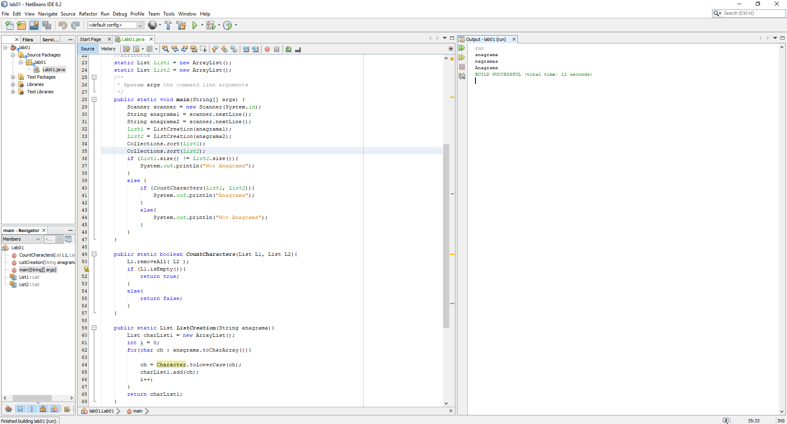
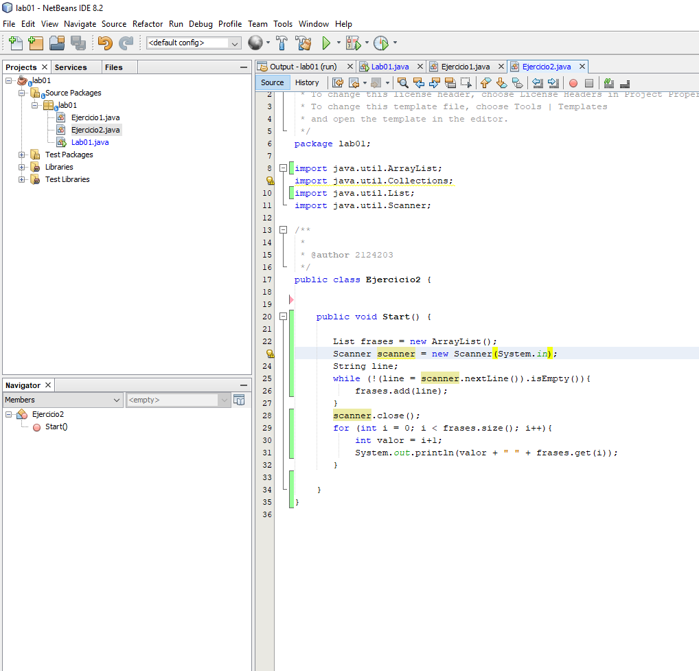
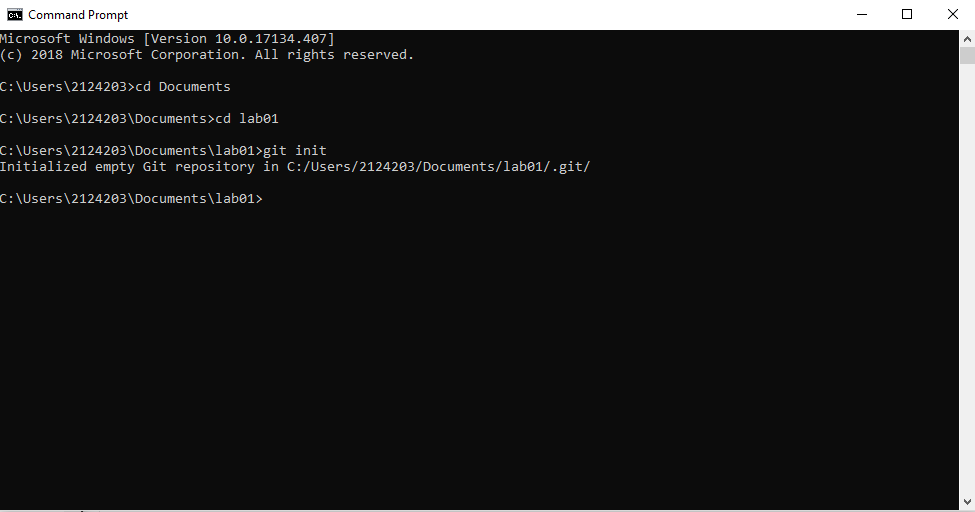
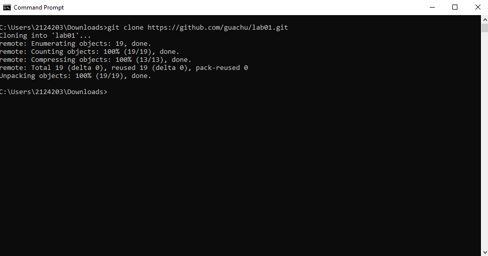

# lab01

#### FIRST EXCERCISE

#### SECOND EXCERCISE

## QUESTIONS

1. What is the purpose of this command? (git add .)

	- "Propose" changes, add it to the Index of the project.
	
2. Why we used it? (git commit -m "Message")

	- Commit changes to head, specially to identify important changes.
 
3. What is the purpose of the this command? (git push origin master)

	- Send changes to the master branch of our remote repository.
	
4. What is the purpose of this command? (git clone <repository>)

	- Running the command we create a working copy for a remote repository.

5. What that command does? (git pull origin master)

	- Fetch and merge changes on the remote server to Master branch.
